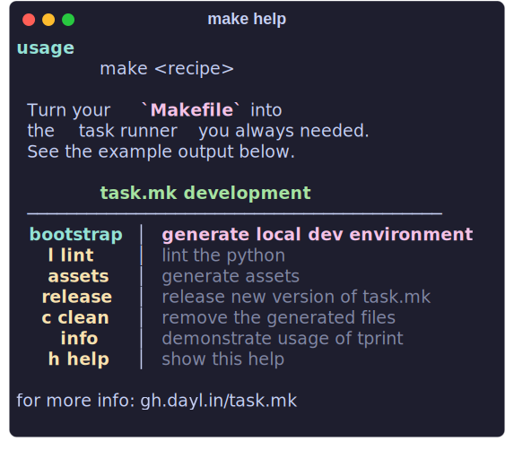

<div align="center">
  <h1 align="center"> task.mk </h1>
  
  <p align="center">
  the task runner for GNU Make you've been missing
  </p>
  <p align="center">
  <a href="https://gh.dayl.in/task.mk">Documentation</a>
  </p>

</div>

</br>

GNU make is an excellent build tool and the task runner we love to hate, but can't escape.
So let's improve the UX to make it the best task runner it can be.

`Task.mk`, is a standalone `Makefile` you can deploy alongside your own
to add some QOL improvements for your users and fellow maintainers.

Current Features:
  - ANSI escape code support (including NO_COLOR)
  - formatted help output
  - custom print function
  - confirmation prompt

Depends on `GNU Make`, obviously and `Python >=3.7`, and `bash` (or `zsh`).

Wait python?!?!, I'm not `pip` installing some package just to parse my makefile.
I agree, all you need is one file [`.task.mk`](./task.mk).
You can automagically include it with just two additional lines to your `Makefile` (and probably one to your `.gitignore`) and your good to go.

## Setup

You can include this as an optional dependency on your project by adding the below lines to the end of your `Makefile`.
If someone tries to invoke `make help` it will download `.task.mk` for them.

```make
-include .task.mk
$(if $(filter help,$(MAKECMDGOALS)),$(if $(wildcard .task.mk),,.task.mk: ; curl -fsSL https://raw.githubusercontent.com/daylinmorgan/task.mk/v22.9.19/task.mk -o .task.mk))
```

You might also consider making it a consistently downloaded dependency if you plan to use any of it's advanced feature set, by dropping the `$(MAKECMDGOALS)` check.

```make
-include .task.mk
$(if $(wildcard .task.mk),,.task.mk: ; curl -fsSL https://raw.githubusercontent.com/daylinmorgan/task.mk/v22.9.19/task.mk -o .task.mk)
```

For more info see the [documentation](https://gh.dayl.in/task.mk).

## Simpler Alternative

But I just want a basic help output, surely I don't need python for this... you would be right.
`Task.mk` replaces my old `make help` recipe boilerplate which may better serve you (so long as you have `sed`/`awk`).


```make
## h, help | show this help
### additional text printed with the help
.PHONY: help h
help h: Makefile
	@awk -v fill=$(shell sed -n 's/^## \(.*\) | .*/\1/p' $< | wc -L)\
		'match($$0,/^## (.*) \|/,name) && match($$0,/\| (.*)$$/,help)\
		{printf "\033[1;93m%*s\033[0m | \033[30m%s\033[0m\n",\
		fill,name[1],help[1];} match($$0,/^### (.*)/,str) \
		{printf "%*s   \033[30m%s\033[0m\n",fill," ",str[1];}' $<
```
