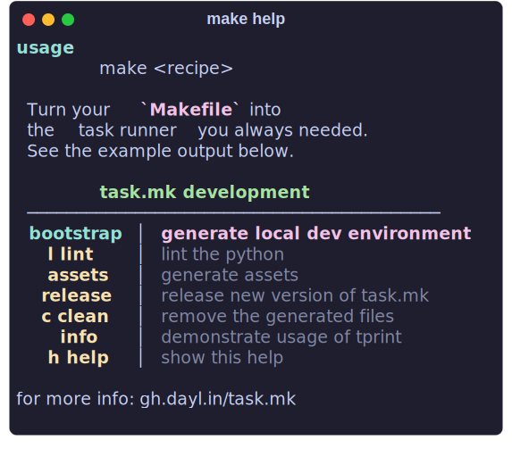

<div align="center">
  <h1 align="center"> task.mk </h1>
  
  <p align="center">
  the task runner for GNU Make you've been missing
  </p>
  <p align="center">
  <a href="https://gh.dayl.in/task.mk">Documentation</a>
  </p>
</div>
</br>

GNU make is an excellent build tool and the task runner we love to hate, but can't escape.
So let's improve the UX to make it the best task runner it can be.

`Task.mk`, is a standalone `Makefile` you can deploy alongside your own
to add some QOL improvements for your users and fellow maintainers.

Current Features:

  - ANSI escape code support (including NO_COLOR) 
  - formatted help output
  - custom print function
  - confirmation prompt
  - goal phonifier (disabled by default)

Depends on `GNU Make`, obviously and `Python >=3.7`, and `bash` (or `zsh`).

Wait python?!?!, I'm not `pip` installing some package just to parse my makefile.
I agree, all you need is one file [`.task.mk`](https://github.com/daylinmorgan/task.mk/v2024.1001/task.mk)
You can automagically include it with just two additional lines to your `Makefile` (and probably one to your `.gitignore`) and you're good to go.

## Setup

One line setup to download .task.mk and add appropriate includes to your `Makefile`.
```bash
bash <(curl -fsSL gh.dayl.in/task.mk/init) # or w/ TASKMK_VERSION=
```

You can include this as an optional dependency on your project by adding the below lines to the end of your `Makefile`.
If someone tries to invoke `make help` it will download `.task.mk` for them.

```make
-include .task.mk
$(if $(filter help,$(MAKECMDGOALS)),$(if $(wildcard .task.mk),,.task.mk: ; curl -fsSL https://raw.githubusercontent.com/daylinmorgan/task.mk/v2024.1001/task.mk -o .task.mk))
```

If you plan to use any features besides the help prompt you may want to instead commit `.task.mk` to version control or drop the `$(MAKECMDGOALS)` check so it's always downloaded once `make` is invoked.

```make
-include .task.mk
$(if $(wildcard .task.mk),,.task.mk: ; curl -fsSL https://raw.githubusercontent.com/daylinmorgan/task.mk/v2024.1001/task.mk -o .task.mk)
```

For more info see the [documentation](https://gh.dayl.in/task.mk).
